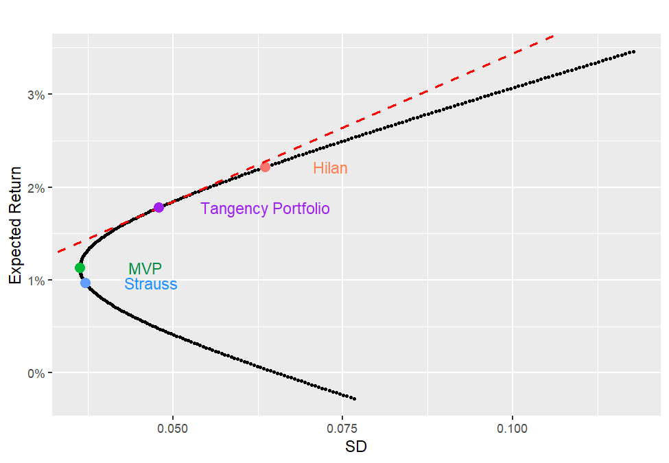
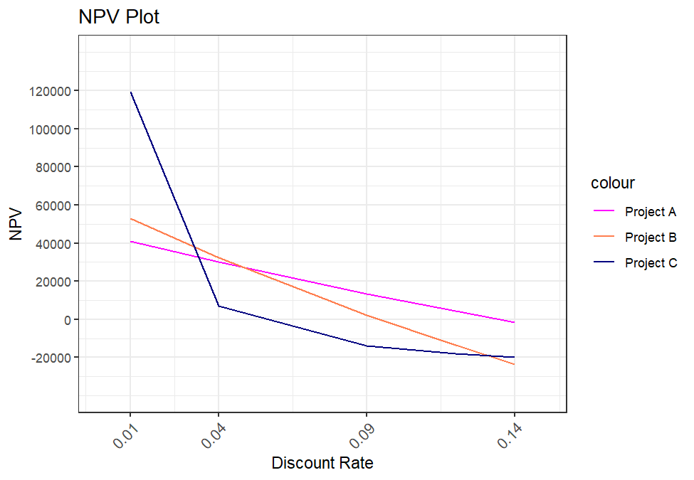
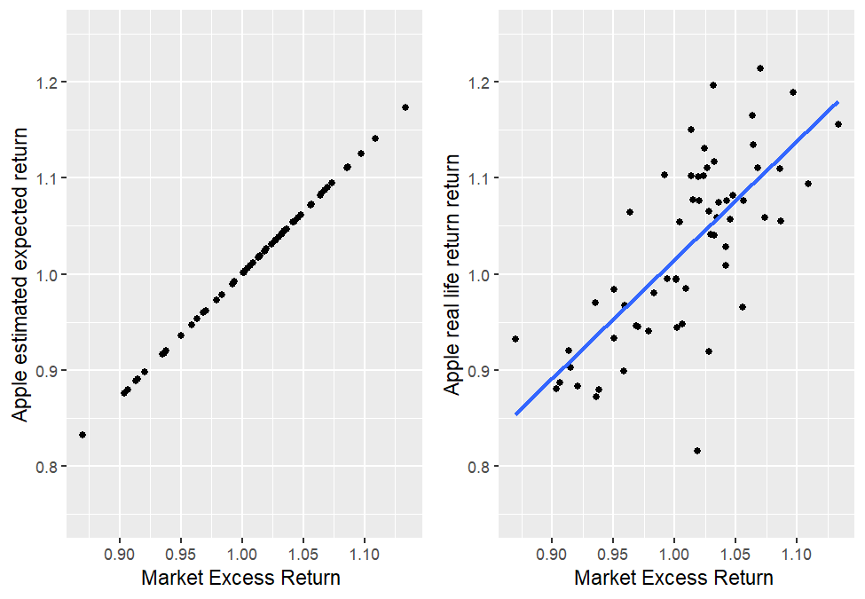

# Finance & Investment Analysis

A corporate finance and portfolio analysis in R, using real Israeli and US market data. It covers capital budgeting, real-estate versus stock-market returns, Markowitz portfolio optimisation, CAPM betas tested out-of-sample, ETF performance and an IPO valuation.

**[Read the full report (PDF) →](docs/finance_report.pdf)**



## Highlights

- **Real estate beat the market.** Buying a ₪1M apartment in 2012, renting it out and selling it in 2022 gave an **IRR of 10.4%**, above the geometric average return of the S&P 500 (9.7%), MSCI World (6.2%), TA-125 (5.6%) and the Tel-Bond 20 corporate bond index (2.0%) over the same years. Financing a quarter of it with a bank loan raised the IRR to **11.1%**.
- **Portfolio optimisation.** Strauss and Hilan have a monthly return correlation of only 0.39. The minimum-variance portfolio is 87% Strauss / 13% Hilan, and with a 3% risk-free rate the **tangency portfolio is 35% / 65%** (Sharpe ratio 0.32).
- **CAPM holds up out-of-sample.** Betas estimated on 2013-2017 (Apple 1.29, Coca-Cola 0.69, Disney 1.22, Abbott 1.52) track the stocks' actual 2018-2022 behaviour against the market well. Abbott deviates the most, plausibly because of COVID-19.
- **Capital budgeting.** The NPV of three projects is compared across discount rates, showing how the best choice switches from Project B at 4% to Project A at 12%.

| NPV of three projects by discount rate | CAPM: Apple, predicted vs. actual (2018-2022) |
|:---:|:---:|
|  |  |

## Contents

| Part | Topic |
|---|---|
| 1 | Effective annual rates, NPV of three projects, and choosing between independent and mutually exclusive projects |
| 2 | IRR of an Israeli rental apartment (with and without a loan) vs. stock and bond indices, using arithmetic and geometric means |
| 3 | Two- and three-stock portfolios: returns, risk, correlation, efficient frontier, minimum-variance and tangency portfolios |
| 4 | CAPM: estimating betas in-sample (2013-2017) and testing them out-of-sample (2018-2022) |
| 5 | Equal-weight S&P 500 and Nasdaq Internet ETFs: Sharpe ratio and alpha |
| 6 | Market anomalies: the turn-of-the-month effect |
| 7 | IPO valuation with the Gordon growth model, plus P/E and P/S ratios |
| 8-9 | Israeli IPO statistics 2018-2022 and post-IPO performance of recent listings |

## Data

All data is in [`data/`](data). It includes monthly and daily prices from Yahoo Finance, the Wall Street Journal and the Tel Aviv Stock Exchange, plus Israeli housing price and rent indices from the Central Bureau of Statistics.

## How to run

You need R with these packages, plus a LaTeX installation for the PDF (for example `tinytex::install_tinytex()`):

```r
install.packages(c("tidyverse", "data.table", "rworldmap", "ggthemes", "reshape2", "e1071",
                   "rvest", "corrplot", "moments", "spatstat.geom", "PortfolioAnalytics",
                   "gridExtra", "quadprog", "rmarkdown", "knitr"))
rmarkdown::render("finance_analysis.Rmd")
```

## Tools

R · tidyverse · ggplot2 · R Markdown · LaTeX

## Background

Written in June 2023 as a group assignment for *Finance for Economists* at the Hebrew University of Jerusalem (B.Sc. Statistics & Data Science).
